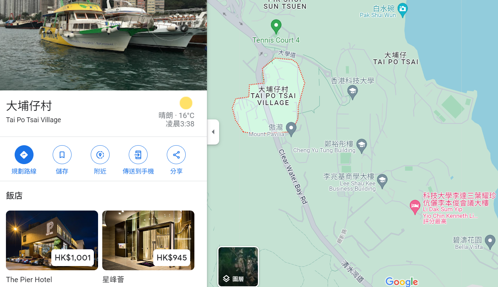

# The Hong Kong University of Science and Tecnology (HKUST)
[A university](https://hkust.edu.hk/) with the address "Clear Water Bay, Kowloon, Hong Kong". It was [forced into Kowloon](https://zh.wikipedia.org/zh-hk/%E9%A6%99%E6%B8%AF%E7%A7%91%E6%8A%80%E5%A4%A7%E5%AD%B8#cite_note-%E9%A6%99%E6%B8%AF%E7%A7%91%E6%8A%80%E5%A4%A7%E5%AD%B8%E5%9C%B0%E5%9D%80%E5%AF%AB%E6%B3%95-2) even though it is geographically in the New Territories because "Clear Water Bay" sounds nicer than "Tai Po Tsai".
 

  ([Base image from Wikipedia](https://en.wikipedia.org/wiki/Kowloon_Peninsula#/media/File:Hong_Kong_Kowloon.svg))

## Tai Po Tsai Village
The village next to HKUST where you might get cheap housing from.
 

  (Copyright Google Maps)

# North Gate / North Bus Stop
The northern entrance of HKUST. You are dropped off here if you came from Choi Hung via bus route 91, 91M or 792M, or minibus route 11.

## Hang Hau
Where another [MTR station](https://en.wikipedia.org/wiki/Hang_Hau_station) is located at. You can get on bus route 91M ("Diamond Hill" direction) or minibus route 11 ("Choi Hung" direction) or 11M (HKUST direction) towards HKUST.
There is also a special bus route 91B which goes directly to HKSUT every school day at 8:30 am.
   
Routes to HKUST:
  - 11M minibus
  - 11 minibus
  - 91M bus
  - 91B bus (at 0830 every weekday)
  - 792M bus (at Hau Tak Estate/Hang Hau North)

## Tiu Keng Leng / Tseung Kwan O
Both [Tiu Keng Leng](https://en.wikipedia.org/wiki/Tiu_Keng_Leng_station) and [Tsueng Kwan O](https://en.wikipedia.org/wiki/Tseung_Kwan_O_station) have MTR stations. You can take bus route 792M towards HKUST here, but there are fewer buses than Hang Hau.
   
Routes to HKUST:
  - 792M bus

# South Gate / South Bus Stop
The southern entrance of HKUST. You are dropped off here if you came from Hang Hau via bus route 91M, or minibus route 11 or 11M.

## Choi Hung
Where a [Mass Transit Railway (MTR) station](https://en.wikipedia.org/wiki/Choi_Hung_station) is located at. You can get on bus route 91 ("Clear Water Bay" direction) or 91M ("Po Lam" direction), or minibus route 11 ("Hang Hau" direction) towards HKUST. 91P is also available in the morning.
   
Routes to HKUST:
  - 91 bus
  - 91M bus
  - 91P bus

## Diamond Hill
Where a [Mass Transit Railway (MTR) station](https://en.wikipedia.org/wiki/Diamond_Hill_station) is located at. You can get on bus route 91 ("Clear Water Bay" direction) or 91M ("Po Lam" direction) towards HKUST.
   
Routes to HKUST:
  - 91 bus
  - 91M bus
